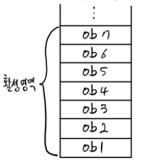
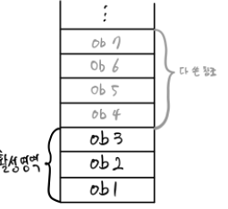

# Item.07 다 쓴 객체 참조를 해제하라
---

C나 C++처럼 메모리를 직접 관리해주는 언어를 쓰다가 Java처럼 Garbage Collector(GC)를 갖춘 언어로 넘어오면, 더 이상 메모리 관리에 대해 신경 쓰지 않아도 된다고 오해할 수 있는데, <u>절대
사실이 아니다</u>

책에서 보여주는 Stack 클래스 예제 코드를 보자

```java
public class Stack {
    private Object[] elements;
    private int size = 0;
    private static final int DEFAULT_INITIAL_CAPACITY = 16;

    public Stack() {
        elements = new Object[DEFAULT_INITIAL_CAPACITY];
    }

    public void push(Object e) {
        ensureCapacity();
        elements[size++] = e;
    }

    public Object pop() {
        if (size == 0)
            throw new EmptyStackException();
        return elements[--size];
    }

    /**
     * 원소를 위한 공간을 적어도 하나 이상 확보한다.  
     * 배열 크기를 늘려야 할 때마다 대략 두 배씩 늘린다.  
     */
    private void ensureCapacity() {
        if (elements.length == size)
            elements = Arrays.copyOf(elements, 2 * size + 1);
    }
}
```

특별한 문제가 없어 보이지만, 해당 코드에서는 <mark>메모리 누수</mark>가 일어나고 있다

바로 pop() 메서드가 그 원인이다

  push를 계속 해서 스택에 많은 데이터가 쌓여 있다가

  pop을 통해 데이터를 꺼낸다고 했을 때

이미 꺼내어진 데이터들은 사용되는 곳은 없지만 다 쓴 참조(obsolete reference)를 여전히 가지고 있기 때문이다


## 메모리 누수 주원인

앞서 말한 예시처럼 GC(Garbage Collector)가 마법처럼 다 해줄 것 같지만 생각보다 메모리 누수가 종종 발생한다
그 원인 중 크게보면 아래와 같다

- 직접 메모리를 관리하는 경우
- 캐시
- 리스너/콜백
  
공통점은 어딘가 특정 자료구조에 데이터를 쌓아 놓기만 하고, 실수로 인해서 참조 해제를 하지 않는 경우 주로 발생한다


### 직접 메모리를 관리하는 경우
Stack 예시 처럼 직접 메모리를 관리하는 경우에는 명시적으로 <mark>해당 참조를 다 썼을 때 null 처리</mark>를 해주면 된다
```java
class Stack {
    // ...
    public Object pop() {
      if (size == 0)
        throw new EmptyStackException();
      Object result = elements[--size];
      elements[size] = null; // 다 쓴 참조 해제
      return result;
    }
    // ...
}
```
이렇게 함으로써 가비지 컬렉터에 더이상 쓰지 않을 것임을 알려 주어야 한다
(가비지 컬렉터 입장에서는 활성/비활성 객체 둘 다 Stack 에서 사용중인 것으로 판단하기 때문)

또한, 다 쓴 참조를 null 처리를 하게 되면 실수로 사용하게 될 경우 NullPointerException 을 유발할 수 있으므로 조기에 대응할 수 있다

하지만 이 방식은 <u>예외적인 경우</u>이며 모든 객체를 사용하고 나서 일일이 null 처리하는 방식은 바람직하지 않다

가장 좋은 방법은 그 <u>참조를 담은 변수를 <mark><i>유효 범위(scope) 밖으로 밀어내는 것이다</i></u></mark>


### 캐시(Cache)
객체 참조를 캐시에 넣고 나서, 객체를 다 쓴 뒤로도 한참을 그냥 놔두게 되면 메모리 누수가 발생할 수 있다.
이 경우 해법은 여러가지가 있는데

1. 캐시(Cache)의 Key에 의존하는 동안에만 Value가 필요한 경우 WeakHashMap을 사용하자
WeakHashMap는 더이상 사용하지 않는 객체를 GC할 때 자동으로 삭제해주는 Map으로 WeakReference를 사용하여 구현된 Map이다

Key를 통해서 캐시에 접근하여 필요한 로직을 모두 수행한 뒤,
Key를 null로 초기화 하면 GC가 돌 때 자동으로 Map에서 삭제가 된다

단, 이 방식을 사용한다면 반드시 Map의 Key는 커스텀한 CacheKey 클래스를 만들어 사용해야한다
JVM 내부에서 일부의 값들을 캐싱을 하고 있기 때문에 Interger, Long, String 등과 같은 기본 Reference Type 클래스를 Key로 사용하게 되면 null로 초기화 하더라도 Map에서 삭제되지 않는다.

(Reference에 대한 내용은 아래에서 자세히 다루도록 한다)

2. 쓰지 않는 캐시 내 엔트리를 청소해주자
(ScheduledThreadPoolExecutor 같은) 백그라운드 스레드를 활용해 주기적으로 오래된 캐시는 청소를 해주는 방법이다
혹은 LinkedHashMap의 경우 removeEldestEntry 메소드도 제공한다

3. 더 복잡한 캐시를 만들고 싶다면 java.lang.ref 패키지를 직접 활용해야 할 것이다
java.lang.ref 패키지를 활용하면 다양한 Reference들을 사용할 수 있다


## 리스너(Listener) 혹은 콜백(Callback)
리스너와 콜백도 결국엔 List나 Map과 같은 자료구조를 통해 저장해두는데, 이를 등록만 하고 명확히 해제하지 않는 경우 메모리 누수가 발생한다
이럴 때 콜백을 약한 참조(Weak reference)를 활용하면 해결할 수 있다

(마찬가지로 Reference에 대한 내용은 아래에서 자세히 다루도록 한다)


## Reference 종류
- **Strong Reference**
    - 우리가 흔히 사용하는 '=' 을 사용하여 할당하는 경우

- **Soft Reference**
	- 현재 대상 객체의 참조가 SoftReference만 있는 경우 JVM의 여유 메모리가 없다면 해당 객체을 GC 대상으로, 메모리 여유가 있다면 GC 대상으로 두지 않는다
```java
public class SoftReferenceExample {  
  
    public static void main(String[] args) throws InterruptedException {  
        Object strong = new Object();  
        SoftReference<Object> soft = new SoftReference<>(strong);  
        strong = null;  
  
        System.gc();  
        Thread.sleep(3000L);  
  
        // 없어지지 않는다 
        // 왜냐면 메모리가 충분해서.. 굳이 제거할 필요가 없으니까..
        System.out.println(soft.get());  
    }  
}
```

- **Weak Reference**
	- 현재 대상 객체의 참조가 WeakReference만 있는 경우 해당 객체를 GC 대상으로 둔다
```java
public class WeakReferenceExample {  
  
    public static void main(String[] args) throws InterruptedException {  
        Object strong = new Object();  
        WeakReference<Object> weak = new WeakReference<>(strong);  
        strong = null;  
  
        System.gc();  
        Thread.sleep(3000L);  
  
        // TODO 거의 없어집니다.  
        //  왜냐면 약하니까(?)...  
        System.out.println(weak.get());  
    }  
}
```

- **Phantom Reference**
	- 바로 지우지 않고, PhantomReference를 ReferenceQueue에 넣고 나중에 정리할 수 있게 한다
	- 자원 정리를 할 때나, 언제 객체가 메모리에서 해제 되는지 알아야 할 때 사용된다
```java
public class PhantomReferenceExample {  
  
    public static void main(String[] args) throws InterruptedException {  
        BigObject strong = new BigObject();  
        ReferenceQueue<BigObject> rq = new ReferenceQueue<>();  
  
        BigObjectReference<BigObject> phantom = new BigObjectReference<>(strong, rq);  
        strong = null;  
  
        System.gc();  
        Thread.sleep(3000L);  
  
        //  GC되지 않고 큐에 들어간다
        System.out.println(phantom.isEnqueued());  // true 출력 
  
        Reference<? extends BigObject> reference = rq.poll();  
        BigObjectReference bigObjectCleaner = (BigObjectReference) reference;  
        bigObjectCleaner.cleanUp();  
        reference.clear();  
    }  
}
```

---
